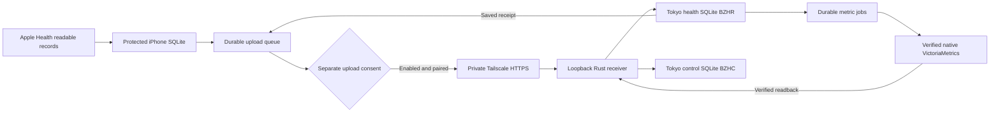

# Boaz Health

Development entry points: [Claude Code](CLAUDE.md) · [Codex and shared agent rules](AGENTS.md) · [architecture](design.md) · [project memory](memory.md) · [product requirements](docs/prd.html).

Boaz Health is an iPhone app that reads selected Apple Health and Fitness records into a protected local SQLite database. It presents sleep, fitness, vitals, sample times and counts, and a sync audit. A separate Rust service can receive records in Tokyo after private access, storage, recovery, and device checks pass. Health access, server pairing, and cloud upload consent are separate actions.

**AI-NATIVE GATE: INTERCEPT — release acceptance is incomplete.** This repository contains the implementation and repeatable local checks. The [GRDB client verification report](docs/GRDB_CLIENT_VERIFICATION_2026-09-18.md), earlier [SQLite3-era acceptance report](docs/ACCEPTANCE_REPORT_2026-09-18.md), and retained [2026-09-18 evidence](docs/evidence/2026-09-18) remain historical records for their named source/environment. They do not certify the current combined worktree. The [77-case current-cycle register](docs/TEST_CASES.md#current-worktree-77-case-status-register) and [dated evidence](docs/evidence/2026-09-19/README.md) distinguish passed local checks from blocked device/Tokyo/recovery acceptance. Local test success does not establish an accepted iPhone/Apple Watch release or a deployed Tokyo service. Keep real upload disabled until every applicable release gate passes.

## Local project paths

The working copy used for this delivery is **`/Users/beckliu/Documents/0agentproject2026/boazapp`**. These are development-machine paths; another checkout can use a different root.

| Item | Exact path on this Mac |
|---|---|
| Repository root | `/Users/beckliu/Documents/0agentproject2026/boazapp` |
| Xcode project | `/Users/beckliu/Documents/0agentproject2026/boazapp/boazapp.xcodeproj` |
| iPhone source | `/Users/beckliu/Documents/0agentproject2026/boazapp/boazapp` |
| iPhone test target source | `/Users/beckliu/Documents/0agentproject2026/boazapp/Tests` |
| Rust receiver | `/Users/beckliu/Documents/0agentproject2026/boazapp/Server` |
| Receiver contract and operations guide | `/Users/beckliu/Documents/0agentproject2026/boazapp/Server/README.md` |
| Detailed acceptance cases | `/Users/beckliu/Documents/0agentproject2026/boazapp/docs/TEST_CASES.md` |
| Dated acceptance report | `/Users/beckliu/Documents/0agentproject2026/boazapp/docs/ACCEPTANCE_REPORT_2026-09-18.md` |
| Retained local test evidence | `/Users/beckliu/Documents/0agentproject2026/boazapp/docs/evidence/2026-09-18` |
| Current 77-case status register | `/Users/beckliu/Documents/0agentproject2026/boazapp/docs/TEST_CASES.md` |
| Current-cycle evidence and source identity | `/Users/beckliu/Documents/0agentproject2026/boazapp/docs/evidence/2026-09-19` |
| Generic iOS build output used by the commands below | `/private/tmp/boazapp-dd` |

The phone stores its one database at `Library/Application Support/BoazHealth/health.sqlite` inside the app's own container; P0 does not create a second phone database. The container path changes between installations and is unrelated to the Mac checkout. The GRDB `DatabasePool` uses SQLite WAL with explicit `synchronous=FULL`; WAL and SHM files belong beside that database. Tokyo uses a health ledger and a separate control ledger for revocation, erasure and recovery facts. Both must remain isolated from `/opt/boaz/data/boaz_events.db`, which the older Mac sync replaces.

## What this version covers

The authoritative read allowlist and conversion rules live in [`HealthTypeCatalog.swift`](boazapp/Health/HealthTypeCatalog.swift). The app requests no HealthKit write permission.

| Area | Readable records and displayed units |
|---|---|
| Sleep | Sleep stages and in-bed intervals; session and stage duration |
| Night measurements | **Absolute** sleeping wrist temperature in °C; heart and breathing rates per minute; oxygen saturation in percent |
| Other vitals | Heart rate and resting heart rate; HRV in ms; systolic and diastolic pressure in mmHg; body mass in kg; body fat in percent; BMI |
| Activity | Steps, flights, active energy in kcal, exercise minutes, stand hours, walking/running, cycling, and swimming distance in metres |
| Fitness | Workouts, available workout events, associated heart-rate samples, and daily activity rings with goals |

Only records Apple Health makes readable can be imported. An empty query does not establish that permission was denied, that no record exists elsewhere, or that every source has synchronized. HealthKit quantities do not expose the source app's original entry unit: the app saves a bounded HealthKit quantity representation and an explicit normalized value/unit, plus available source and device details.

Sleep overlaps are resolved within each session to avoid counting the same time twice. Separate nights and naps remain separate. The main card uses the latest completed session; sleep efficiency appears only when in-bed data exists. The app makes no diagnosis or health recommendation.

Current history behavior is explicit:

- Sample imports begin from a nil HealthKit anchor and use pages of at most 500 records. Each saved page and its next anchor share one local transaction. Later anchored queries include additions and deletions.
- Activity summaries use bounded date spans of at most 30 days from 1 January 2014 on an initial/full scan. Both endpoints are inclusive, so a full span can contain 31 daily summaries. Gregorian dates retain the user's timezone. Recent scans revisit seven days; a full scan is requested at least every seven days. A changed day updates its stable identity.
- Workout changes invalidate saved associated details and schedule their replacement. Heart-rate details use their own anchors.
- Derived sleep processing pages the complete local sleep history and reconciles only after a stable scan. Automated cases exercise history beyond the former 100,000-record limit, page boundaries, and concurrent changes; see the report for executed evidence. Actual HealthKit history and phone resource use still need device acceptance.
- HealthKit background delivery depends on iOS scheduling and data availability. It provides no real-time delivery guarantee.

## Data flow and ownership



Tokyo health SQLite is the cloud health-record authority. Tokyo control SQLite is the durable authority for credential tombstones, erasure intent and recovery facts; control intent commits before the health ledger converges, without claiming cross-database atomicity. VictoriaMetrics contains derived numeric projections under `boaz_health_v1_*`, separate from existing text-derived `boaz_v1_*` metrics. The phone never writes directly to VictoriaMetrics. No search engine, vector database, graph database, workflow engine, or language model is needed for this deterministic data path. The app and service make no paid-model calls; ordinary host, network, storage, Apple signing, and maintenance costs still apply.

Each cloud batch has a stable ID, immutable request bytes, a device ID, and at most 200 revisions/128 KiB. A revision identifies the HealthKit sample or derived record, operation, type, source, UTC times, value/unit, and metadata. Tokyo commits records, audit entries, the receipt, and metric jobs together. Retrying identical bytes returns the same receipt; reusing a batch ID with different bytes fails. Unknown or mismatched units can remain in the ledger without becoming misleading metrics.

| App status | What it proves |
|---|---|
| Local saved | The iPhone SQLite transaction completed. |
| Cloud saved | Tokyo returned a saved SQLite receipt, or the phone recovered it by batch ID. |
| Metrics current | The named receiver confirmed projection/readback at the displayed time on its current generation/mapping version. It does not prove every HealthKit source is available or that metrics will be retained forever. |
| Erasure pending | Upload is off; delivery of the request, metric cleanup, or backup expiry may still be pending. |
| Erasure complete | A validated response says that receiver completed its tracked stages at the displayed times. The phone rotates to one new device identity and keeps upload off; the receipt does not prove unknown external copies or future state. |

## Tools and requirements

| Component | Requirement / observed development toolchain |
|---|---|
| iPhone app | iOS 17 or later; iPhone with HealthKit; Xcode supporting Swift 6 |
| Development Mac | Observed on 18 September 2026: Xcode 27.0 (`27A266a`), Apple Swift 6.4 compiler; project uses Swift 6 language mode |
| Device installation | Apple development team, a suitable signing profile, and HealthKit/background-delivery capabilities |
| Receiver build | Rust edition 2024; observed `rustc` and Cargo 1.96.0; committed `Server/Cargo.lock` |
| Project regeneration | Python 3; observed Python 3.14.6 |
| Production receiver | Native Linux process, native VictoriaMetrics, encrypted storage and backups, Tailscale private HTTPS, completed restore drill |

The iOS app uses Apple frameworks plus the reviewed GRDB.swift 7.11.1 Swift package for its local SQLite engine; the app does not directly manage SQLite handles. The resolved package identity is tracked in `boazapp.xcodeproj/project.xcworkspace/xcshareddata/swiftpm/Package.resolved`. Resolve that exact package before an offline build. The Rust service has dependencies pinned through its lockfile. Its `--offline` commands require those crates to already be cached; on a new development machine, run `cargo fetch --locked` from `Server` once with network access.

## Build and use the iPhone app

Open the project:

```sh
cd /Users/beckliu/Documents/0agentproject2026/boazapp
open boazapp.xcodeproj
```

Select the shared `boazapp` scheme. In Signing & Capabilities, choose the development team and an appropriate bundle identifier. The checked-in default is `com.beckliu.boazhealth`; the entitlements include HealthKit and HealthKit background delivery. Select a physical iPhone, then build and run. An unsigned generic build is useful for compilation but cannot install the app or validate HealthKit, Keychain, haptics, background delivery, accessibility, or rendering on a device.

Compile the app and its iOS test bundle without signing:

```sh
cd /Users/beckliu/Documents/0agentproject2026/boazapp
xcodebuild -project boazapp.xcodeproj -scheme boazapp \
  -destination 'generic/platform=iOS' \
  -derivedDataPath /private/tmp/boazapp-dd \
  CODE_SIGNING_ALLOWED=NO build-for-testing
```

For actual iPhone tests, use Xcode Product → Test after selecting a connected and trusted device with working signing. `build-for-testing` alone does not execute tests. Simulator tests can validate deterministic app behavior, but physical HealthKit authorization, Watch-origin samples, locked-phone behavior, and haptics need real-device acceptance.

On 18 September 2026, simulator tests ran on iOS 26.5; an earlier empty dashboard screenshot was inspected. At the last read-only inspection, a physical iPhone was paired and wired but reported `connected (no DDI)`: Xcode could not personalize its developer disk image, so signed installation and interactive HealthKit/settings/consent/audit acceptance remain incomplete. The earlier [SQLite3-era acceptance report](docs/ACCEPTANCE_REPORT_2026-09-18.md) and the [current GRDB client verification](docs/GRDB_CLIENT_VERIFICATION_2026-09-18.md) distinguish their evidence and limits.

On the phone:

1. Open Health settings and choose **Review Health access**. Select the Health types to make readable, then run the app's sync action to import locally.
2. Inspect recent measurements and the Sync audit. Empty or partial availability must remain visible as such.
3. After Tokyo passes its release gates, enter the private `https://<host>.<tailnet>.ts.net` root address and an operator-issued ten-minute one-use 64-hex pairing secret. The app accepts HTTPS on the default port or port 443, rejects extra URL components, and refuses redirects. Choose **Pair this iPhone**.
4. Read the separate upload disclosure, select its consent toggle, and choose **Enable cloud upload**. Pairing alone does not turn upload on.
5. Use **Stop upload** to pause further transfer. Use **Request cloud erasure** for deletion, then retain the app's erasure recovery information through every pending state. Only a valid complete response clears old credentials and rotates to a new device ID. Local Health records remain; any later transfer requires new pairing and new consent.

The credential and erasure recovery secret are stored in device-only Keychain entries accessible after the first unlock. The local database uses iOS file protection until the first user authentication, and its directory is explicitly marked as excluded from system backups. The simulator checks the exclusion attribute; actual backup exclusion, locked-phone protection, and post-reboot behavior still require physical-device verification.

The simulator does not report an effective file-protection class. Simulator builds apply the protection setting but skip its read-back; signed physical-device builds require the expected class. Simulator test success must never be reported as proof of encryption. A protection failure after a local commit preserves the saved records and blocks upload until the app can verify protection again.

After adding/removing Swift source or XCTest files, regenerate the project from the repository root and review the resulting difference:

```sh
python3 scripts/generate_xcode_project.py
git diff -- boazapp.xcodeproj/project.pbxproj
python3 scripts/generate_xcode_project.py --check
```

The optional icon-generation command is:

```sh
swift scripts/generate_icon.swift boazapp/Resources/Assets.xcassets/AppIcon.appiconset/AppIcon.png
```

## Build and inspect the receiver locally

```sh
cd /Users/beckliu/Documents/0agentproject2026/boazapp/Server
cargo build --release --offline --locked
```

This creates a binary for the current host at `Server/target/release/boaz-health-receiver`. A macOS binary is not a Linux deployment artifact. Build the Tokyo binary on Linux or with an independently verified Linux toolchain.

To inspect a disposable local receiver with upload closed, run this from `Server`:

```sh
BOAZ_TEST_DIR=$(mktemp -d /private/tmp/boaz-health-local.XXXXXX)
export BOAZ_HEALTH_DATA_ROOT="$BOAZ_TEST_DIR/data"
export BOAZ_HEALTH_DB="$BOAZ_TEST_DIR/data/health.db"
export BOAZ_HEALTH_CONTROL_DB="$BOAZ_TEST_DIR/control/control.db"
export BOAZ_HEALTH_CONTROL_MIRROR_DIR="$BOAZ_TEST_DIR/control/mirror"
export BOAZ_HEALTH_BACKUP_DIR="$BOAZ_TEST_DIR/backups"
export BOAZ_HEALTH_CONTROL_VOLUME_ENCRYPTED=0
export BOAZ_HEALTH_PORT=18787
export BOAZ_HEALTH_UPLOAD_ENABLED=0
./target/release/boaz-health-receiver init-storage
./target/release/boaz-health-receiver verify-storage
./target/release/boaz-health-receiver serve
```

It binds only `127.0.0.1:18787`; stop it with Ctrl+C. In another terminal, this read request should return HTTP 401 because status requires a device token:

```sh
curl -i http://127.0.0.1:18787/v1/health/status
```

An unauthenticated status rejection is an access-control check, not an ingestion test. The automated server suite creates isolated synthetic databases to exercise the contract. Do not set production gate flags merely to make a local command succeed.

The complete API, storage lifecycle, operator commands and erasure states are described in [`Server/README.md`](Server/README.md). Control backup and staged restore commands now exist, but `restore-health` exits nonzero at the required projection-rebuild stage; it does not complete recovery or cut over production. Deployment examples are in [`Server/deploy`](Server/deploy).

## Tokyo deployment and recovery gates

The [Tokyo preflight](docs/TOKYO_PREFLIGHT.md) is a dated observation from 18 September 2026. It found Docker owning the existing metrics listener, no separate encrypted health storage, no Tailscale Serve route, and no deployed health receiver. Those observations block real upload; they are not a claim about future host state.

Before opening ingest, the operator must verify all of the following and record evidence in a new dated acceptance report:

1. A dedicated encrypted health ledger, encrypted native metric storage, encrypted managed backups, and a separately recoverable encrypted control-ledger domain with recorded key custody. The current Linux verifier recognizes dm-crypt; production backup/prune reject a mere encryption flag unless the backup mount is verified dm-crypt on a device distinct from both live databases. Provider-managed encryption remains unverified until a deterministic verifier exists.
2. A native VictoriaMetrics executable, its actual loopback listener, and its configured storage identity. Docker or an HTTP success response alone cannot pass this check.
3. A receiver running as a dedicated service account and binding loopback, with private Tailscale Serve HTTPS and a tailnet rule permitting only intended devices. Do not use Tailscale Funnel.
4. Successful encrypted backup creation, off-host control-head verification, staging restoration, tombstone replay, receipt/count/hash comparison, native projection rebuild, token revocation, cloud erasure, and rollback drill.
5. Real iPhone/Watch acceptance, representative history measurements, and explicit in-app upload consent.

The sample environment starts every gate at `0`. Native process and encrypted mount checks run again for ingest, so a runtime identity failure closes new uploads. Pending phone records and server projection jobs remain available for retry.

Stopping upload and erasing the cloud copy are separate operations. Erasure first commits a control intent and token tombstone, then reconciles health rows, metric deletion and managed-backup expiry. Managed backups must remain in the configured directory; untracked external copies are outside that proof. The backup script's retention target does not by itself prove all copies expired. Follow the [receiver recovery instructions](Server/README.md#backup-and-recovery) and [preflight rollback sequence](docs/TOKYO_PREFLIGHT.md#proposed-change-sequence-and-rollback) before any production change.

## Tests and acceptance

Run these from the repository root:

```sh
python3 scripts/generate_xcode_project.py --check
bash scripts/test_ios_simulator.sh
bash scripts/test_local_core.sh
bash scripts/test_gateway_transport.sh
cargo test --manifest-path Server/Cargo.toml --offline --locked
cargo clippy --manifest-path Server/Cargo.toml --offline --locked --all-targets -- -D warnings
python3 scripts/test_server_http.py --build
python3 scripts/verify_doc_governance.py
git diff --check
```

`scripts/test_ios_simulator.sh` is the governed full-suite runner: it selects an explicit, booted or latest available iPhone simulator, uses Debug and one architecture, disables parallel tests, isolates DerivedData/xcresult, compares discovered and executed test counts, and fails on skipped tests or SQLite API/vnode warnings. The local-core and gateway scripts run focused synthetic scenarios with temporary databases and no real Tokyo requests. These measurements cover local storage and request behavior, not actual HealthKit or private-network throughput. The earlier Mac direct-SQLite3 timings in the dated acceptance report are historical context, not a same-environment comparison.

The gateway scenarios exercise the production client's request construction and receipt handling through an in-process URL protocol, using a synthetic batch from the local GRDB ledger. They verify unchanged retry bytes, origin validation and receipt mismatch rejection without resolving a hostname or contacting Tokyo. They do not establish private HTTPS, certificate validation or a complete phone-to-server round trip.

The Rust tests exercise request handling, identity/consent gates, duplicate and conflicting batches, revisions and deletions, retry/receipt behavior, metric outages, and backup/erasure interactions. The Swift JSON fixture also checks that the two implementations agree on actual request bytes and receipt hashes. The HTTP script builds and runs a real receiver process on a temporary loopback port with upload disabled, checks access rejection and an unchanged database, and cleans up the child process and temporary data. A sandbox refusal to bind that port is an environment failure, not a passing check. Current-worktree simulator commands and final test counts belong in a new 2026-09-19 evidence record; do not rewrite the historical 2026-09-18 report.

| Evidence | Location and use |
|---|---|
| Detailed test cases | [`docs/TEST_CASES.md`](docs/TEST_CASES.md): inputs, preconditions, steps, expected outcomes, and required evidence |
| Executed acceptance results | [`docs/ACCEPTANCE_REPORT_2026-09-18.md`](docs/ACCEPTANCE_REPORT_2026-09-18.md): commands, outcomes, limitations, corrections, and release decision |
| Historical GRDB client migration results | [`docs/GRDB_CLIENT_VERIFICATION_2026-09-18.md`](docs/GRDB_CLIENT_VERIFICATION_2026-09-18.md): results for its recorded source identity and remaining device gates |
| Test logs and supporting files | [`docs/evidence/2026-09-18`](docs/evidence/2026-09-18): reproducible synthetic evidence, source identity, and the inspected dashboard screenshot |
| Swift unit tests | [`Tests`](Tests): sleep calculations and durable local ledger behavior |
| Server integration tests | [`Server/tests/api.rs`](Server/tests/api.rs) |
| Synthetic iOS XCTest core scenarios | [`scripts/test_local_core.sh`](scripts/test_local_core.sh), [`Tests/LocalHarnessMigrationTests.swift`](Tests/LocalHarnessMigrationTests.swift), [`scripts/LocalCoreHarness.swift`](scripts/LocalCoreHarness.swift) |
| Synthetic iOS XCTest transport scenarios | [`scripts/test_gateway_transport.sh`](scripts/test_gateway_transport.sh), [`scripts/GatewayTransportHarness.swift`](scripts/GatewayTransportHarness.swift) |
| Local HTTP process check | [`scripts/test_server_http.py`](scripts/test_server_http.py) |
| Tokyo environment observations | [`docs/TOKYO_PREFLIGHT.md`](docs/TOKYO_PREFLIGHT.md) |

Acceptance requires a successful build, passing applicable automated cases, an inspected real-device flow, tested failure/recovery behavior, and deployed Tokyo evidence. A compiled test bundle, a synthetic API test, or a successful HTTP request cannot substitute for the missing device, encryption, native metrics, restore, and private-access checks. Initial import duration, phone storage, Tokyo disk use, and projection delay must be measured on representative data before full-history upload is enabled.

## Repository guide

```text
boazapp.xcodeproj/          Xcode project and shared scheme
boazapp/
  App/                     App lifecycle, coordination, consent and credentials
  Health/                  HealthKit allowlist, queries, models and sleep analysis
  Core/Database/           Local SQLite schema, revisions, anchors and upload queue
  Core/Network/            Collection/upload coordination and Tokyo HTTP client
  UI/                      Dashboard, health sections, settings and sync audit
  Resources/               Info.plist, HealthKit entitlements and icon
Tests/                     iOS XCTest sources
Server/
  src/                     Receiver, validated storage, health/control ledgers and projection
  tests/                   Synthetic API tests and Swift request fixture
  deploy/                  Example service, environment and managed backup script
scripts/                   Project/icon generation and local Swift verification
docs/                      Test plan, acceptance evidence and Tokyo preflight
```

Do not commit health databases, pairing codes, device credentials, signing identities, or real HealthKit exports. The repository ignores database files, local environments, signing files, Xcode user state, and build output. App version text comes from the built bundle. Existing Boaz assistant queries, watchOS app development, clinical interpretation, and public internet access are outside this release.
